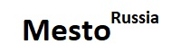

---

**[Проект: Mesto-React](https://aleksandr-hohlov.github.io/mesto/)**

### Проектная работа №4.

**Описание проекта:**

- создана маршрутизация по проекту;
- добавлены формы Регистрации и авторизации (пример почты для регистрации email@yandex.ru);
- реализована работа с локальным хранилищем и токеном;
- вёрстка адаптивная: ширина зоны с содержимым меняется вместе с шириной окна браузера;
- реализовано с использованием React;
- файловая структура реализована по БЭМ;
- проект создан по макету Figma;

---

**_[Ссылка на проект Mesto-React](http://mesto-avtor-hohlovaleks.nomoredomains.club/)_**

---
